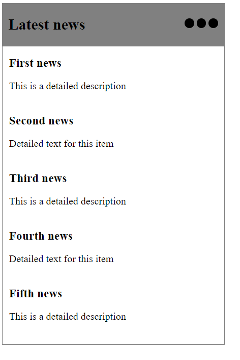

# News-widget

1.	This is a widget box (news), which has to display 15 news, with pagination (3 pages). The news are take through API, calling: http://www.mocky.io/v2/58fda6ce0f0000c40908b8c8. 

1.★	The 3 dots must switch pages.

1.★	Every 15 seconds, the next page should will be displayed.

1.★	The Widget will be updated every 3 minutes reloading the page.

